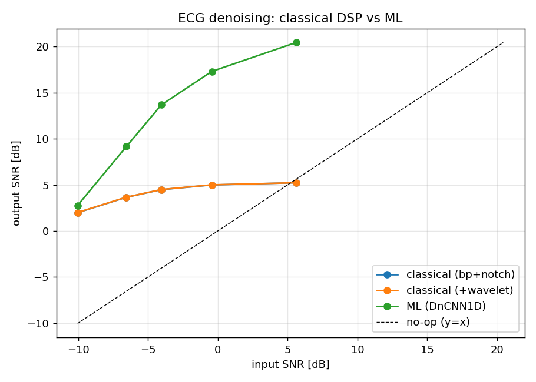
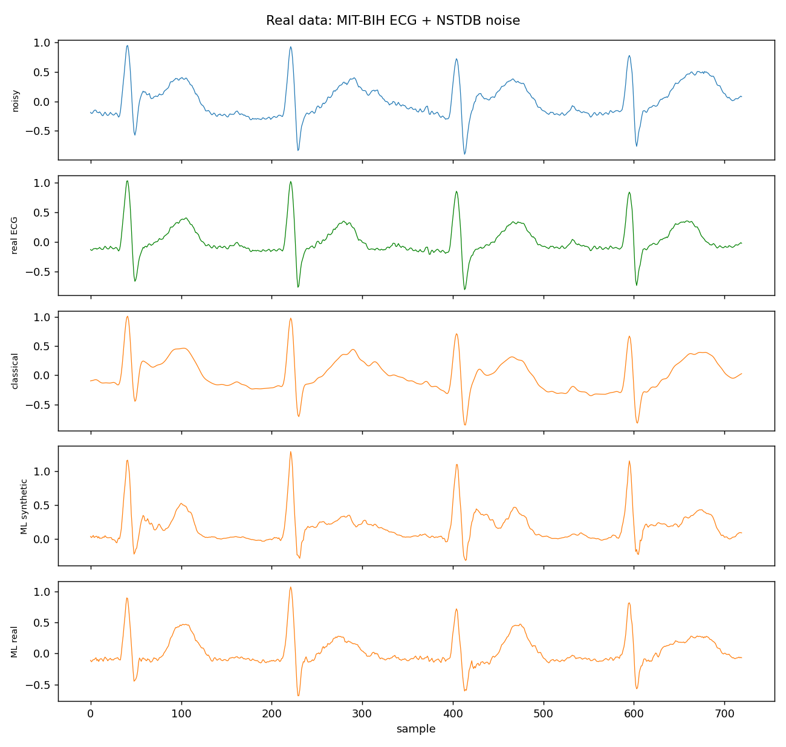
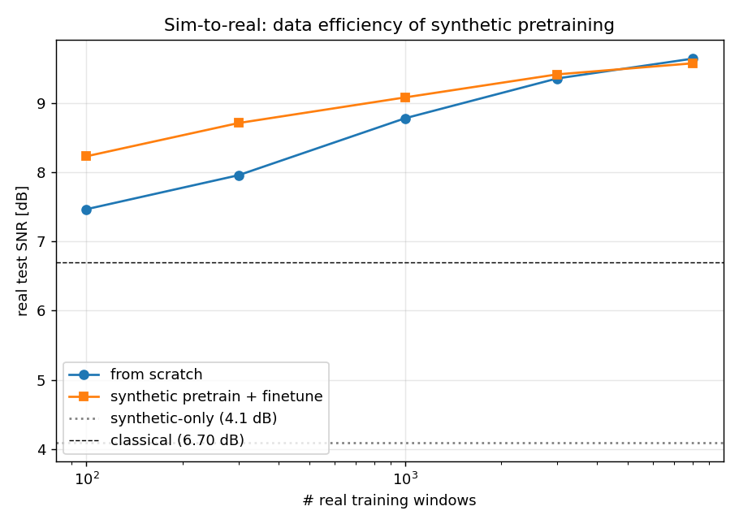
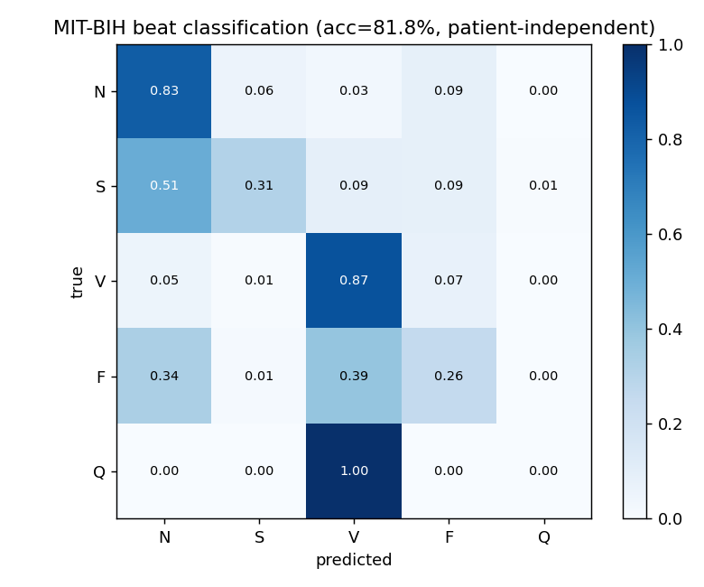
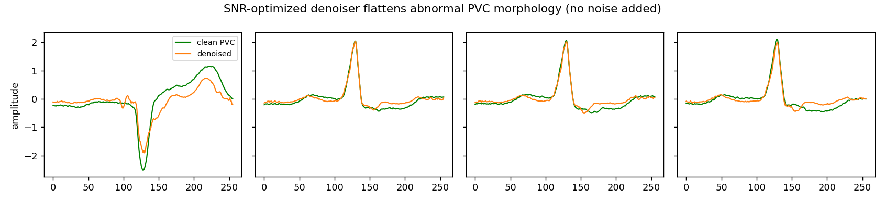
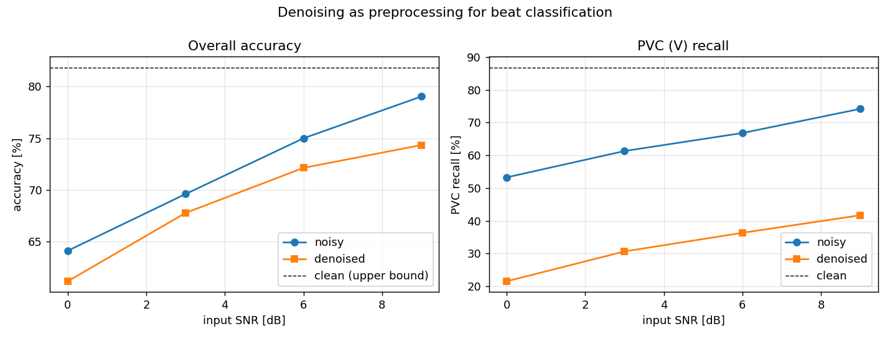
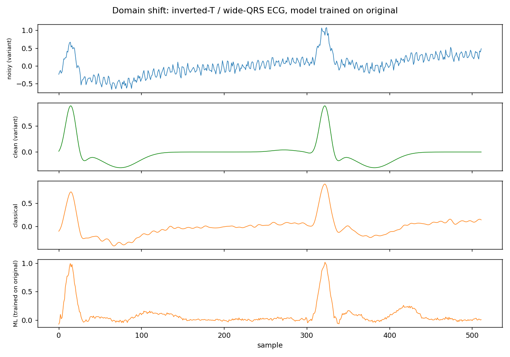
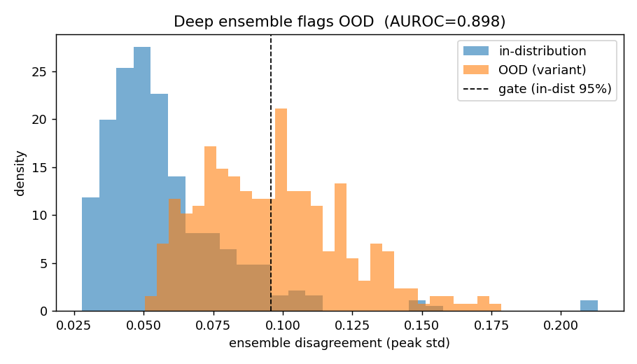
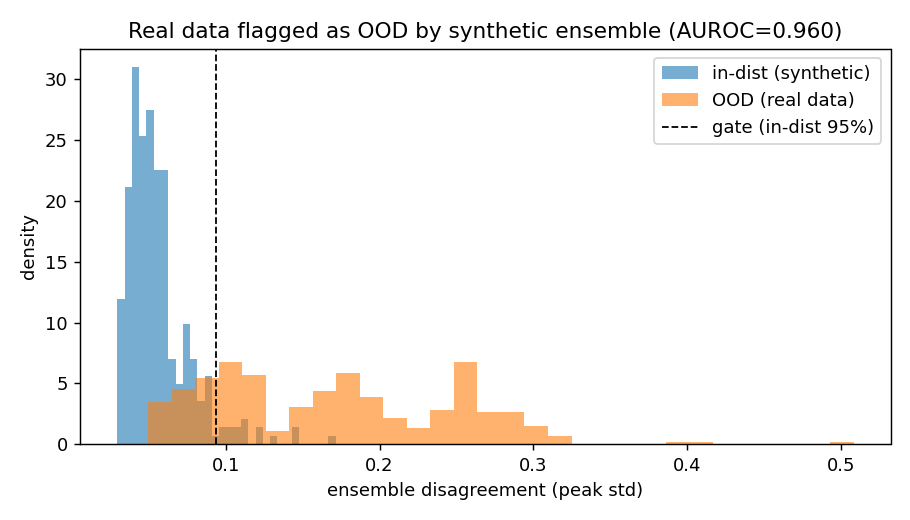

# signal-ml-lab

**A lab for denoising biosignals (ECG) with classical DSP vs. machine learning — and comparing them honestly, on the same metrics.**

A public learning project by a DSP algorithm engineer moving into ML. Every signal
here is either a public dataset ([PhysioNet](https://physionet.org/)) or synthetic.
No proprietary data or algorithms from any company are included.

🇰🇷 [한국어 README](README.ko.md)

## Why ECG denoising
- Denoising is the fairest arena to pit classical DSP (filters, wavelets) against
  learned methods **on identical metrics**.
- The noise model (baseline wander, 60 Hz powerline, EMG) is physically explicit,
  so honest experiments are possible with synthetic data alone.
- Results land cleanly in SNR/RMSE — you can answer "how much better, really?"
  with a number.

## TL;DR — the story this repo tells
1. A classical filter chain sets a solid baseline but **plateaus** (~5 dB output SNR).
2. A small 1D CNN (**DnCNN**) beats it by **10–15 dB** in-distribution.
3. On **out-of-distribution** ECG the ML model **collapses** and silently distorts
   clinically important morphology — while classical stays robust.
4. On **real MIT-BIH data + real noise**, the synthetic-trained model transfers
   *below classical* — but trained on real data it wins by ~2.8 dB (the sim-to-real gap).
5. **Mixed-distribution training** buys robustness back; a **deep-ensemble gate**
   (AUROC 0.90) flags OOD inputs so bad outputs are catchable.
6. The model is tiny (**220 KB**, **1161× real-time** on one CPU core) → edge-deployable.

## Results (synthetic test set, SNR sweep)

| input SNR | classical (bp+notch) | ML (DnCNN1D) |
|----------:|---------------------:|-------------:|
|  +5.6 dB  | 5.2 dB               | **20.4 dB**  |
|  −0.4 dB  | 5.0 dB               | **17.3 dB**  |
|  −4.0 dB  | 4.5 dB               | **13.7 dB**  |
|  −6.6 dB  | 3.7 dB               | **9.2 dB**   |
| −10.0 dB  | 2.0 dB               | 2.8 dB       |

- ML beats classical by **10–15 dB** at low/mid noise.
- At **extreme noise (−10 dB) the advantage nearly vanishes** — an honest limit.
- Wavelet thresholding adds almost nothing over bandpass+notch for this noise model.



## Real data — the sim-to-real gap (capstone)

The synthetic story above is only convincing if it survives real signals. Test set:
**real MIT-BIH ECG** (ground truth) + **real NSTDB noise** (baseline wander, muscle
artifact, electrode motion) added at controlled SNR (`scripts/08_real_data.py`).

| method | output SNR | gain |
|--------|-----------:|-----:|
| noisy input | 2.83 dB | — |
| classical (bp+notch) | 6.70 dB | +3.87 |
| **ML (synthetic-trained)** | 4.09 dB | +1.26 |
| **ML (real-trained)** | **9.45 dB** | **+6.62** |

- The **synthetic-trained model transfers poorly** — it scores *below classical* on
  real data (4.09 < 6.70 dB) and overshoots R-peaks, imposing its synthetic prior.
  The generalization tax, now confirmed on **real signals**, not just a synthetic variant.
- **Trained on real data, ML wins clearly** (9.45 dB, +2.8 over classical).
- Lesson: sim-to-real is a real gap. A model is only as good as the realism of its
  training distribution — architecture doesn't rescue a distribution mismatch.



### Resolution — synthetic as a pretraining prior

Synthetic data isn't useless — it's a **cheap pretraining prior** that makes real-data
learning far more data-efficient (`scripts/09_finetune_curve.py`).

| # real windows | from scratch | synthetic-pretrained |
|---------------:|-------------:|---------------------:|
| 100 | 7.47 dB | **8.23 dB** |
| 300 | 7.96 dB | **8.71 dB** |
| 1000 | 8.78 dB | **9.09 dB** |
| 8000 | 9.65 dB | 9.58 dB |

- **Just 100 real windows already beat classical (6.70 dB)** and crush synthetic-only (4.09).
- Synthetic pretraining helps most in the **low-data regime** (+0.75 dB at N=100–300);
  the gap closes once real data is plentiful.
- So the full sim-to-real story: *synthetic alone doesn't transfer, but as a pretraining
  prior it cuts the real-data budget several-fold.*



## Beyond denoising — arrhythmia classification

A denoiser is a means; diagnosis is an end. Using MIT-BIH beat annotations, a small
1D-CNN (36k params) classifies each beat into the 5 AAMI classes (N/S/V/F/Q), with a
**patient-independent** train/test split (different records) — the honest setting many
papers skip (`scripts/10_arrhythmia.py`).

- Overall accuracy **81.8%** on ~33k held-out beats from unseen patients.
- **PVC (V) detection: 87% recall** — the clinically important abnormal beat is caught well.
- Rare classes (S/F/Q) are hard: severe class imbalance (N ≈ 30k vs S ≈ 260, F ≈ 390).
  An honest limitation, not hidden by patient-mixed evaluation.



## When denoising *hurts* diagnosis (systems-level "clean but wrong")

The obvious pipeline is denoise → classify. Does denoising a noisy beat recover the
accuracy lost to noise? **No — it makes it worse** (`scripts/12_denoise_then_classify.py`).

| input SNR | accuracy noisy → denoised | PVC recall noisy → denoised |
|----------:|:--------------------------|:----------------------------|
| 9 dB | 79.0% → **74.3%** | 74.2% → **41.7%** |
| 6 dB | 75.0% → 72.1% | 66.8% → 36.3% |
| clean upper bound | 81.8% | 86.8% |

The damage is worst exactly where it matters — **PVC recall halves.** And it's not a
noise artifact: passing *clean* PVC beats through the denoiser alone drops PVC recall
**86.8% → 58.0%**.

**Why:** a denoiser optimized for SNR learns the *average, normal* ECG shape and pulls
everything toward it — attenuating the abnormal morphology that defines a PVC. It makes
signals look cleaner and *more normal*, which is precisely wrong for spotting abnormal
beats. (Two mechanisms compound: the denoiser flattens pathological features, and its
outputs are themselves out-of-distribution for a clean-trained classifier.)



Lesson: **component-wise optimization doesn't compose.** Optimizing a denoiser for
fidelity and a classifier for clean accuracy, then chaining them, degrades the whole.
Pipelines need task-aware design — joint training, or a denoiser whose objective
preserves diagnostic features, not just SNR. This is the project's thesis at the
systems level: *a metric-optimal component can be objective-wrong for the system.*



## Domain shift — the ML trap

Test the ML model (trained only on normal morphology) on a **different distribution**
(inverted T-wave, wide QRS, ectopic beats) and the ranking flips.

| input SNR | classical | ML (trained in-dist) |
|----------:|----------:|---------------------:|
|  +5.2 dB  | **12.1 dB** | 2.4 dB             |
|  −0.8 dB  | **10.2 dB** | 2.5 dB             |
|  −4.3 dB  | **8.3 dB**  | 2.9 dB             |

- The model that won by 15 dB in-distribution now **loses badly** OOD.
- Cause: it imposes its learned prior and **rewrites the inverted T-wave as a normal
  one**. The output looks clean but the clinically important shape is wrong — a
  safety hazard in medical use. It **fails without a signal that it failed.**
- Classical filters make no distributional assumption, so they stay robust.

Core lesson: *an ML edge is valid only inside the training distribution; always
measure the **generalization tax** alongside it.*



### Fix — mixed-distribution training

Train on both morphologies and generalization recovers.

| model | test = original | test = variant |
|-------|----------------:|---------------:|
| original-only | **17.7 dB** | 2.4 dB |
| mixed         | 13.7 dB     | **12.3 dB** |

- Mixed training gives up 4 dB in-distribution to **buy OOD back from 2.4 → 12.3 dB.**
- Data diversity is the most direct way to pay the generalization tax.
- Takeaway: *robustness is set by how well the training distribution covers reality,
  more than by architecture.*

## Knowing when it's wrong — uncertainty as a safety gate

The domain-shift failure above was dangerous because it was **silent**. Can the
model flag its own OOD inputs? Two methods, one test (in-dist vs. variant):

| method | OOD AUROC | detection @5% FPR |
|--------|----------:|------------------:|
| MC-dropout | 0.58 | 9% |
| **deep ensemble (K=4)** | **0.90** | **50%** |

- **MC-dropout barely beats chance** — dropout uncertainty is blind to this subtle,
  locally-plausible shift.
- **A deep ensemble's disagreement flags it** (AUROC 0.90). Members trained from
  different seeds agree in-distribution but diverge on unfamiliar morphology.
- Practical takeaway: pair the denoiser with an ensemble gate; route high-disagreement
  windows to classical DSP or human review. The "clean but wrong" output becomes catchable.



**Does the gate catch the real sim-to-real failure?** Yes. A synthetic-trained
ensemble flags **real** MIT-BIH data as OOD with **AUROC 0.96** — real-data
disagreement is 3.0× the in-distribution level, and the 5%-FPR gate catches **80.7%**
of real inputs (`scripts/11_realdata_gate.py`). So the silent failure of the
synthetic model on real data (above) would have been **caught in deployment** and
routed to the classical fallback.



## Edge deployability (embedded)

Can the denoiser run in real time? (`scripts/06_edge_profile.py`, single thread)

| metric | value |
|--------|-------|
| parameters | 56,289 |
| memory (float32 / int8) | 220 KB / 55 KB |
| compute | 55.9 kMAC/sample (≈20 MMAC/s) |
| latency (1024-window, 1 core) | 2.4 ms |
| real-time factor | 0.0009 (**1161× real-time**) |

- ~20 MMAC/s → with int8 quantization, real-time is realistic even on a Cortex-M
  class MPU. Inference can live where the data is born (wearable, bedside, in-device).
- The intersection of **DSP + ML + embedded real-time** — this project's growth edge.

## Quickstart
```bash
pip install -r requirements.txt

python scripts/01_classical_denoise.py                 # classical baseline (instant)
python scripts/02_train_ml_denoise.py --n 4000 --epochs 30   # train ML (a few min, CPU)
python scripts/03_benchmark.py                         # classical vs ML sweep
python scripts/04_domain_shift.py                      # OOD generalization test
python scripts/05_mixed_training.py                    # recover robustness
python scripts/06_edge_profile.py                      # latency / footprint
python scripts/07_uncertainty.py                       # ensemble OOD safety gate
python scripts/08_real_data.py --train-real            # real MIT-BIH + NSTDB noise
python scripts/09_finetune_curve.py                    # sim-to-real data efficiency
python scripts/10_arrhythmia.py                        # beat classification (patient-independent)
python scripts/11_realdata_gate.py                     # ensemble flags real data as OOD

pytest -q
```
`08` downloads real PhysioNet data via `wfdb`. Behind a corporate TLS proxy, install
`truststore` (auto-used by `realdata.py`) so HTTPS trusts the Windows cert store.
Figures/tables go to `outputs/`, metrics print to the console.

## Layout
```
src/signal_ml_lab/
  synth.py      synthetic ECG (+ variant morphology)
  noise.py      realistic noise model (baseline / powerline / EMG)
  classical.py  classical DSP denoising (bandpass + notch + wavelet)
  models.py     DnCNN1D residual denoiser (PyTorch)
  dataset.py    (clean, noisy) window pairs; mixed-distribution builder
  train.py      training loop + inference
  metrics.py    SNR / RMSE
  data.py       PhysioNet loader (wfdb, optional)
scripts/        01..06 end-to-end experiments
tests/          pytest suite
blog/           write-ups (KR)
```

## Roadmap
- [x] Synthetic ECG + noise model, classical baseline
- [x] DnCNN1D ML denoiser + training pipeline
- [x] Classical-vs-ML benchmark, domain-shift study, mixed-training fix
- [x] Edge profile, unit tests
- [x] Uncertainty as OOD safety gate (deep ensemble, AUROC 0.90)
- [x] Real-data validation: MIT-BIH ECG + NSTDB noise (sim-to-real gap quantified)
- [x] Synthetic→real data-efficiency curve (pretraining prior)
- [x] Arrhythmia classification (patient-independent, AAMI 5-class)
- [x] Denoise→classify coupling: SNR-denoiser *hurts* diagnosis (systems finding)
- [ ] Task-aware / joint denoise+classify training to fix the coupling
- [ ] Address class imbalance (focal loss / resampling) for S/F recall
- [ ] int8 static quantization + on-device benchmark

## License
MIT — see [LICENSE](LICENSE). Uses only public/synthetic data.
